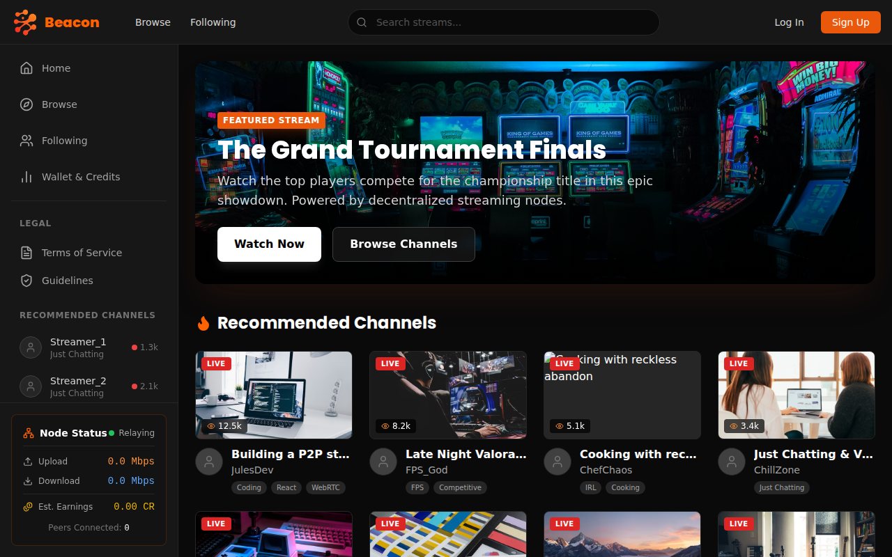
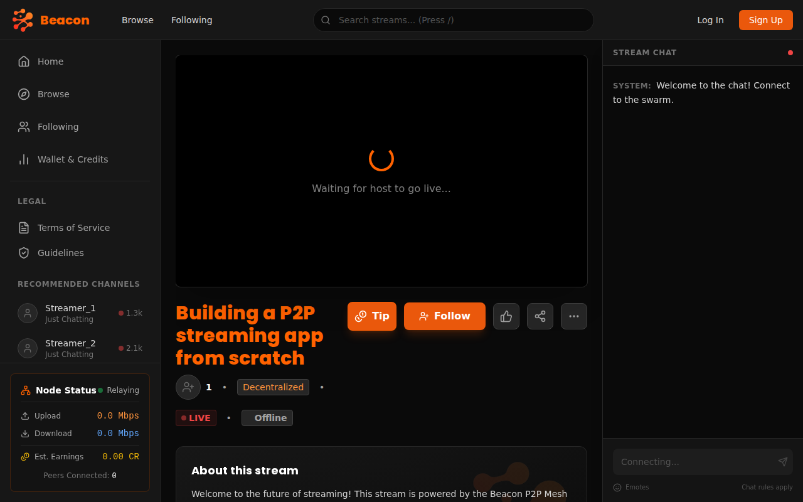
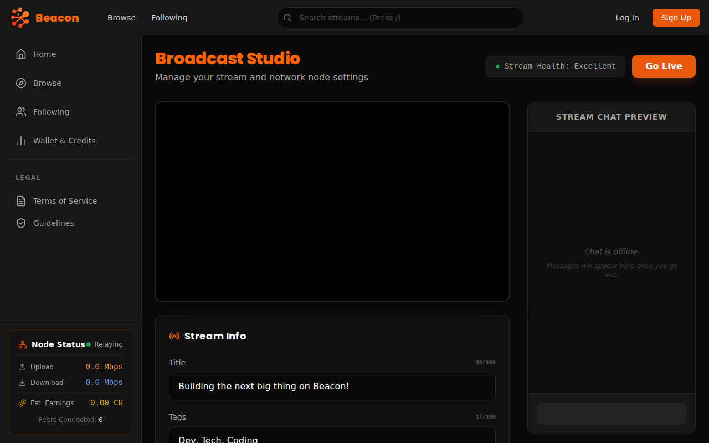
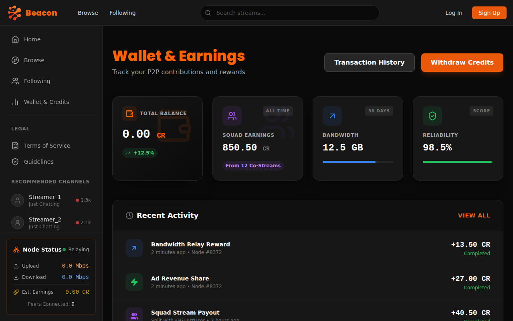

# 🔸 Beacon 🔸

**Beacon** is a next-generation, decentralized Peer-to-Peer (P2P) streaming platform designed to break free from centralized control.

Forget about paying Amazon AWS for server fees. Forget about gatekeepers deciding who gets to blow up. **Beacon** is built by the community, for the community.

## 🍊 The Vision: Decentralized Streaming

Current platforms like Twitch (purple) and Kick (green) rely on massive, expensive server farms. This centralization leads to high costs, arbitrary bans, and unfair revenue splits.

**Beacon is Orange.** We are building a mesh network where every streamer acts as a node. Instead of relying on one person's network or a corporate giant, we distribute the load across everyone watching and streaming.

### 🚫 No Middlemen. No Gatekeepers.
*   **No "Algorithm":** We don't decide who succeeds. You do.
*   **No "Pay-to-Play":** Success is based on your content and contribution to the network.
*   **Community Owned:** Everyone is a node, everyone has skin in the game.

## ⚡ How It Works

### 1. Mandatory Bandwidth Sharing ("No Freeloaders")
To play, you gotta host. It's brutal but fair. By streaming on Beacon, you dedicate a portion of your PC's bandwidth to help relay streams to others.

### 2. Incentivized Contribution
We turn bandwidth into currency.
*   **Earn Credits:** If your upload is solid and you relay streams to other peers, you rack up credits.
*   **Ad Revenue Share:** Ad revenue isn't just for the streamer; it's shared with the nodes (you!) that help deliver the content.
*   **Smart Routing:** WebRTC ensures low-latency connections, finding the best path through the mesh.

### 3. The Economy
*   **Streamers:** Get paid for their content.
*   **Relays:** Get paid for their bandwidth.
*   **Viewers:** Enjoy a platform free from corporate censorship.

## 🛠 Tech Stack

We are building a robust, scalable P2P architecture:

*   **Frontend:** React (for a responsive, modern UI)
*   **Signaling Server:** Node.js (to help peers find each other)
*   **Streaming/Ingest:** Python / FFmpeg (for professional-grade stream handling) or C (for high-performance local nodes)
*   **P2P Protocol:** WebRTC (for real-time, low-latency communication)
*   **Infrastructure:** Specialized mesh networking to avoid single points of failure.

## Progress Screenshots

### Home Page

### Watch Page (Mock Player & Chat)

### Broadcast Studio

### Wallet & Earnings

## 🚀 Roadmap

*   [ ] **MVP Core:** Basic P2P streaming with WebRTC.
*   [ ] **Signaling:** Node.js server for peer discovery.
*   [ ] **Frontend:** React-based viewer and streamer dashboard.
*   [ ] **Economy:** Ad integration and bandwidth credit system.
*   [ ] **Optimization:** Smart routing and mesh stability.

---

*Join the revolution. Light the Beacon.* 🔸
